# 02-SYSTEM-ARCHITECTURE-AND-DIAGRAMS.md

All diagrams use standard Mermaid syntax. Each diagram has a unique ID, title, purpose statement, and a reference to the claims it represents.

---

## DIAG-001: System Context

**Purpose**: Show Format Factory's position relative to external entities.
**Audience**: Technical managers, new contributors.
**Claims**: CLM-SYS-001, CLM-SYS-002

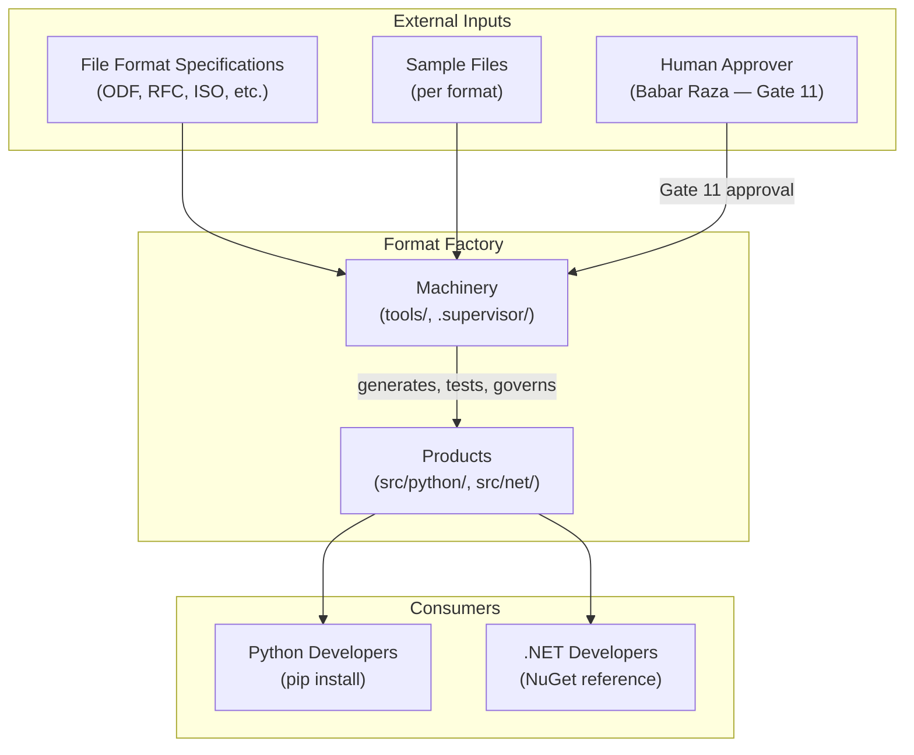

**Legend**: Rounded rectangles = systems/entities. Arrows = data/control flow. The machinery produces the products; humans consume the products.

| Node | Description |
|---|---|
| SPECS | Format specifications from standards bodies |
| SAMPLES | Known-good sample files for each format |
| HUMAN | Business approver for commercial release |
| MACH | Development machinery (85K LOC) |
| PROD | Product libraries (77K LOC) |
| PYDEV | End-user Python developers |
| NETDEV | End-user .NET developers |

---

## DIAG-002: Repository and Subsystem Map

**Purpose**: Map the major repository directories to architectural roles.
**Audience**: Contributors, code reviewers.
**Claims**: CLM-ARCH-001

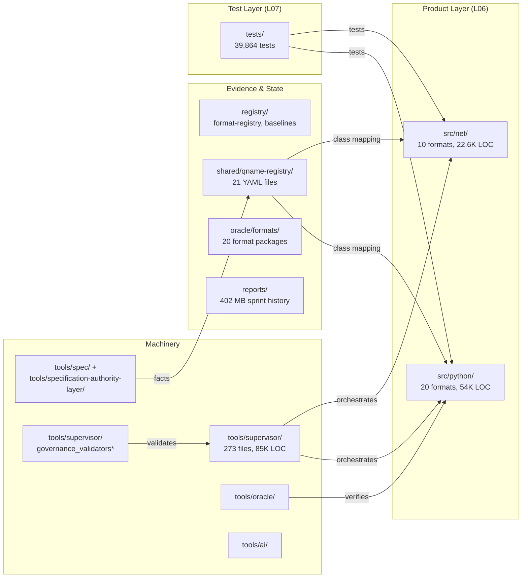

---

## DIAG-003: End-to-End Specification-to-Source Pipeline

**Purpose**: Trace the complete pipeline from specification input to installable library.
**Audience**: Architects, technical leads.
**Claims**: CLM-PIPE-001

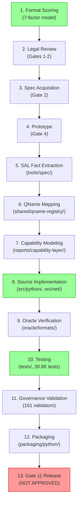

**Legend**: Green = fully operational. Red = blocked/pending. Default = operational.

---

## DIAG-004: Specification Ingestion and Fact Extraction

**Purpose**: Detail how specifications become structured facts.
**Audience**: SAL developers, spec analysts.
**Claims**: CLM-PIPE-002

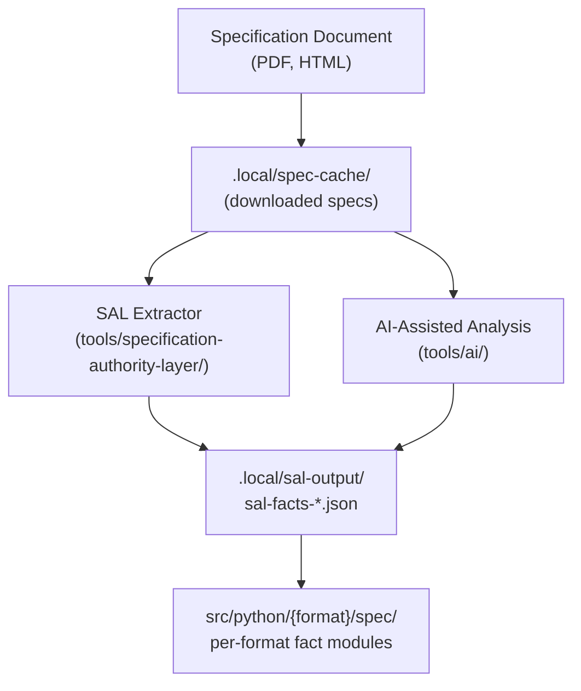

| Node | File Count | Status |
|---|---|---|
| SAL Extractor | 24 .py files | Active |
| AI tools | ~30 .py files | Active |
| Facts output | ~14,719 total facts | 20 formats have facts; 4 have 0 |

---

## DIAG-005: Fact-to-Capability and Capability-to-Feature Flow

**Purpose**: Show how extracted facts become capabilities and work items.
**Audience**: Product planners, capability architects.
**Claims**: CLM-PIPE-003, CLM-PIPE-004

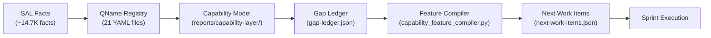

---

## DIAG-006: Source Generation and Object-Model Construction

**Purpose**: Show how source code is structured per format.
**Audience**: Product developers.
**Claims**: CLM-ARCH-002, CLM-ARCH-003

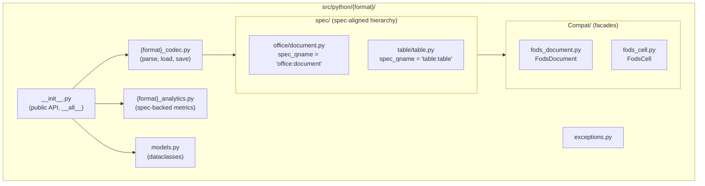

**Key pattern**: Spec QName (e.g., `table:table-cell`) maps to canonical class (`Table.TableCell`) in `spec/`, which is aliased to format-prefixed facade (`FodsCell`) in `Compat/`.

---

## DIAG-007: Product Runtime Architecture

**Purpose**: Show what happens when a user calls `parse_fods("file.fods")`.
**Audience**: API consumers, product developers.
**Claims**: CLM-PROD-001

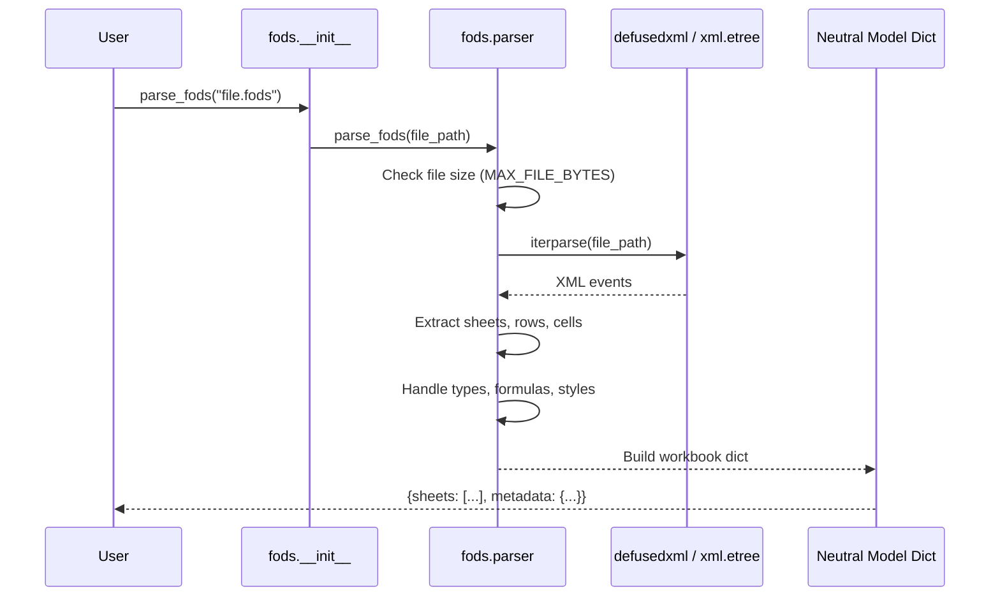

---

## DIAG-008: Agent, Skill, Command, and Supervisor Architecture

**Purpose**: Show how AI agents, skills, and the supervisor interact.
**Audience**: Governance architects, contributors.
**Claims**: CLM-GOV-001, CLM-GOV-002, CLM-ARCH-004

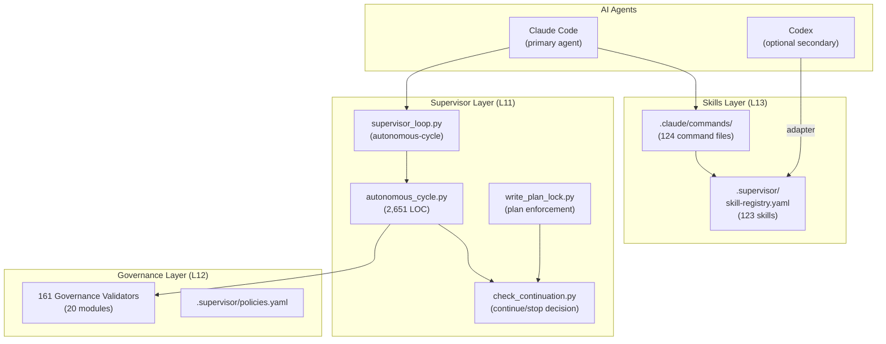

---

## DIAG-009: Autonomous Execution and Governance Control Loop

**Purpose**: Show the sprint loop lifecycle.
**Audience**: System operators, governance architects.
**Claims**: CLM-GOV-002

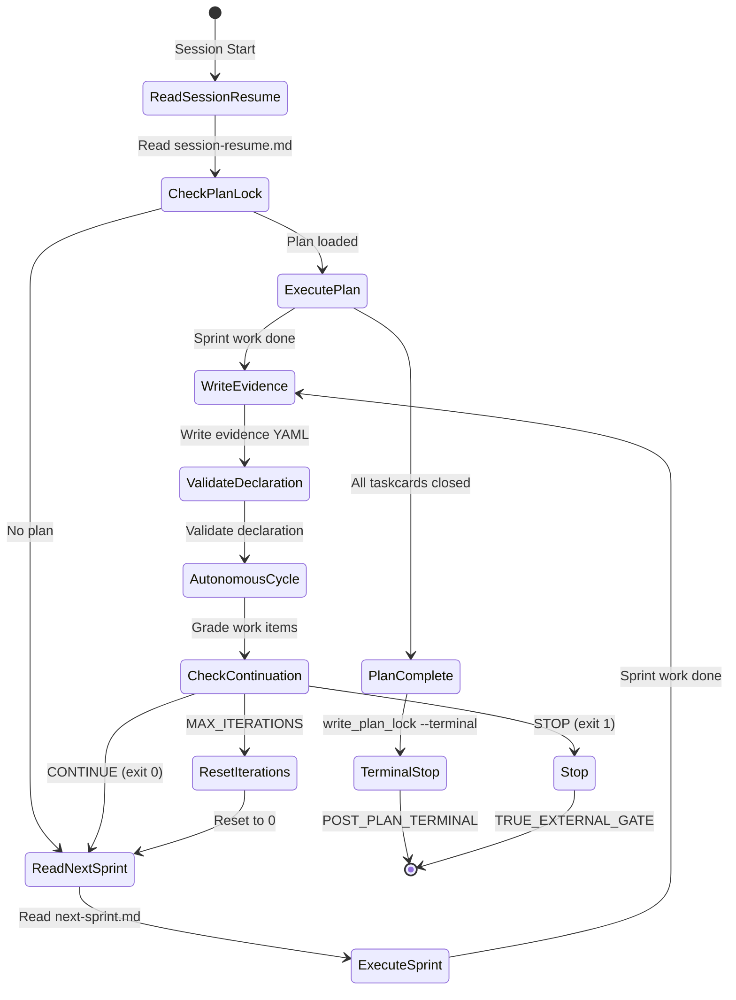

---

## DIAG-010: Validation, Evidence, Gap, Rework, and Approval Loop

**Purpose**: Show how governance validators feed rework and gap tracking.
**Audience**: Quality engineers, governance architects.
**Claims**: CLM-GOV-003

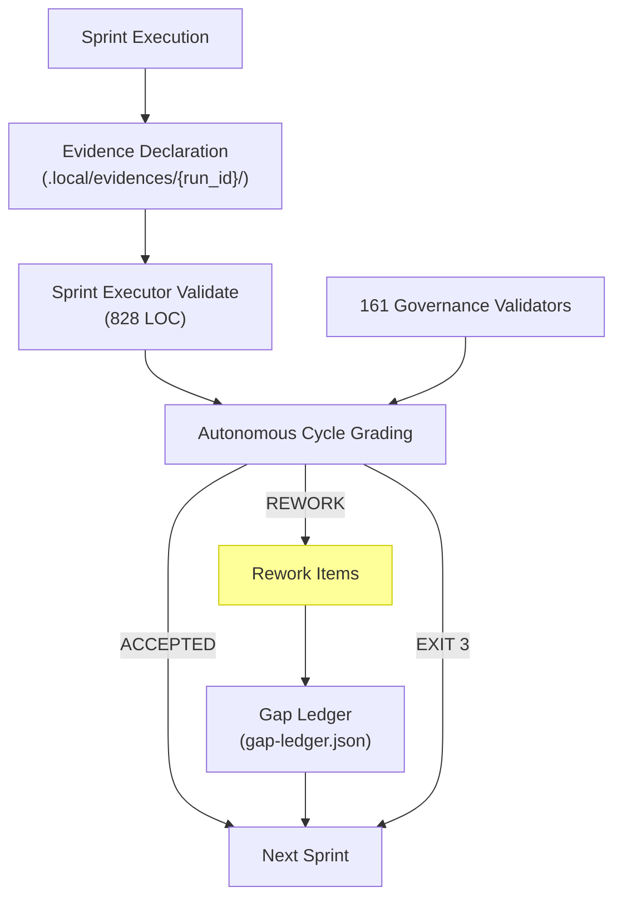

---

## DIAG-011: Artifact and Data Lineage

**Purpose**: Trace artifacts from specification to final package.
**Audience**: Traceability auditors.
**Claims**: CLM-PIPE-001

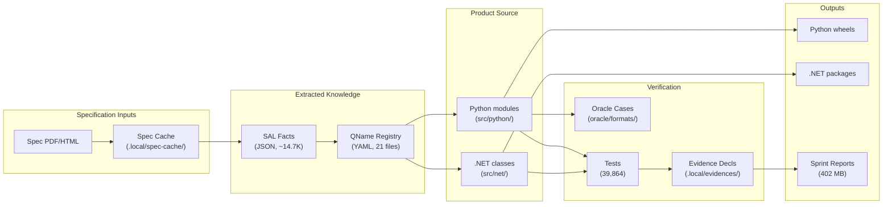

---

## DIAG-012: Happy-Path Execution Sequence

**Purpose**: Show a successful autonomous sprint from start to finish.
**Audience**: System operators.
**Claims**: CLM-GOV-002

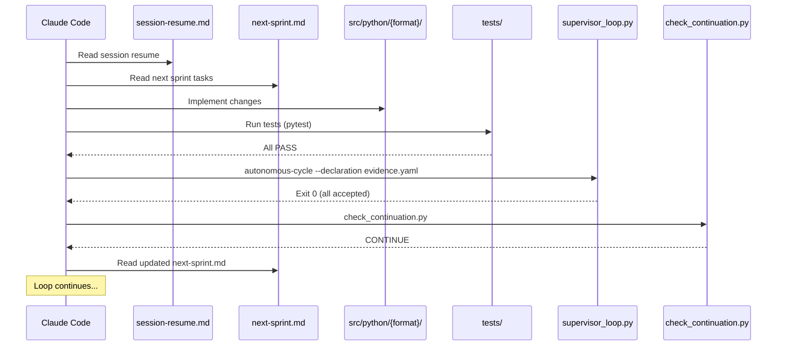

---

## DIAG-013: Failure and Rework Sequence

**Purpose**: Show what happens when a sprint produces rework items.
**Audience**: System operators.
**Claims**: CLM-GOV-002, CLM-GOV-003

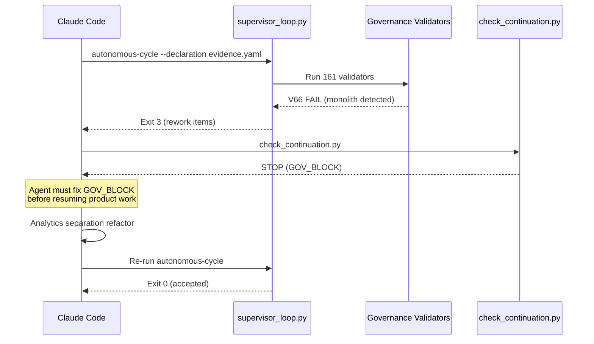

---

## DIAG-014: Product Maturity Coverage Map

**Purpose**: Visualize maturity across formats and capabilities.
**Audience**: Product managers, stakeholders.
**Claims**: CLM-PROD-002

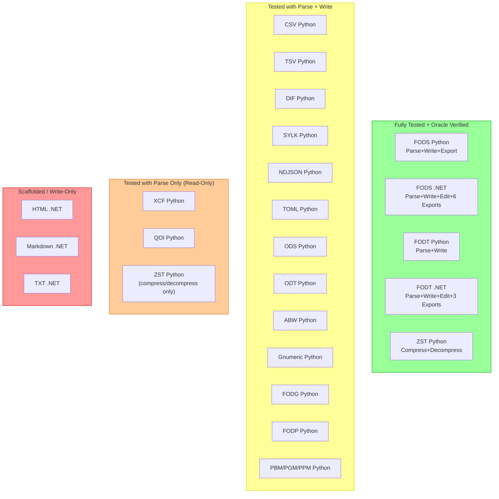

---

## DIAG-015: CI, Packaging, and Release Flow

**Purpose**: Show the CI/CD pipeline from code to potential release.
**Audience**: DevOps engineers.
**Claims**: CLM-ARCH-006

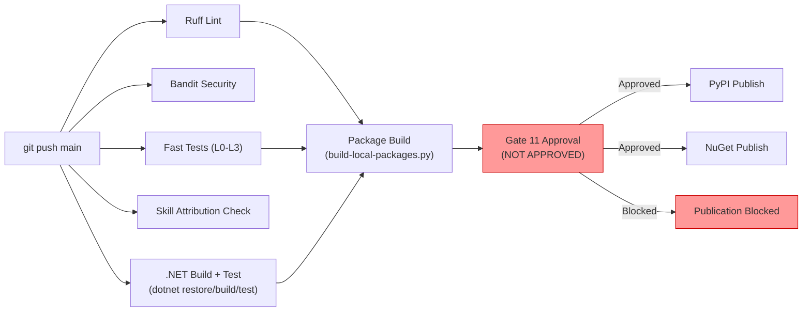

---

## DIAG-016: New-Format Extension Workflow

**Purpose**: Show steps to add a new format to the system.
**Audience**: Contributors, format analysts.
**Claims**: CLM-ARCH-005

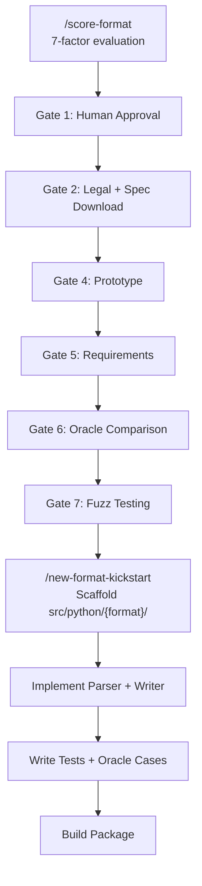

---

## DIAG-017: Generated-versus-Manual Ownership Boundary

**Purpose**: Clarify what is generated and what is hand-written.
**Audience**: Architects, code reviewers.
**Claims**: CLM-ARCH-002

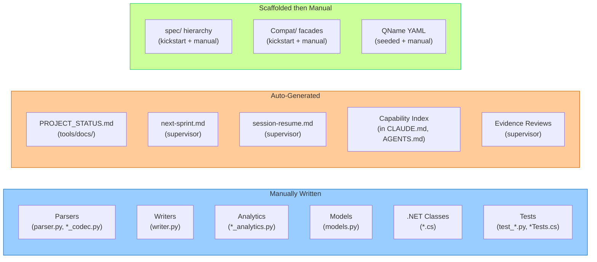

---

## DIAG-018: Current vs Intended Architecture

**Purpose**: Highlight where the current system differs from the documented plan.
**Audience**: Architects, strategic planners.
**Claims**: CLM-SYS-001

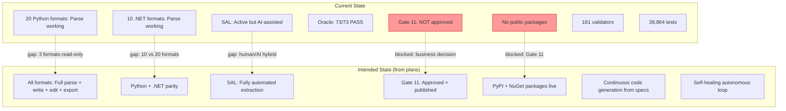

**Key gaps**: 3 Python formats remain read-only (QOI, XCF, ZST). .NET covers half the formats Python does. Publication is blocked on Gate 11 business approval. SAL fact extraction involves AI-assisted steps rather than being fully deterministic. Code generation is scaffolding-based, not continuous regeneration.
