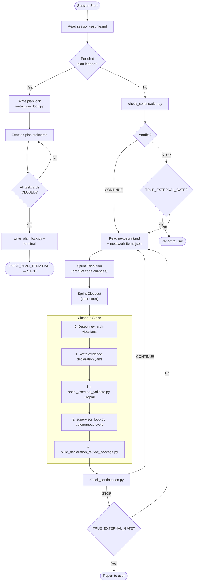
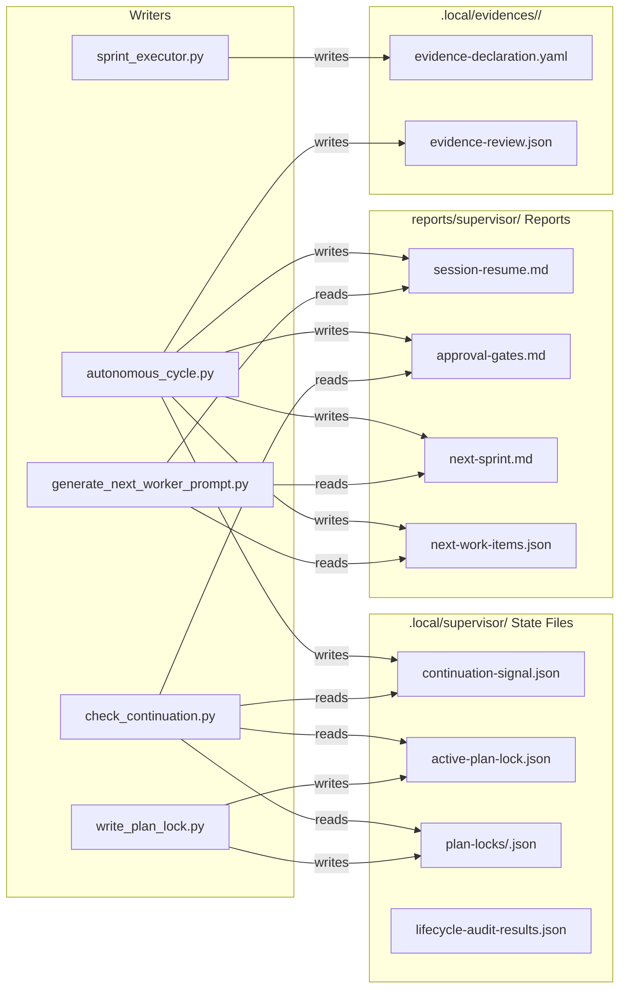
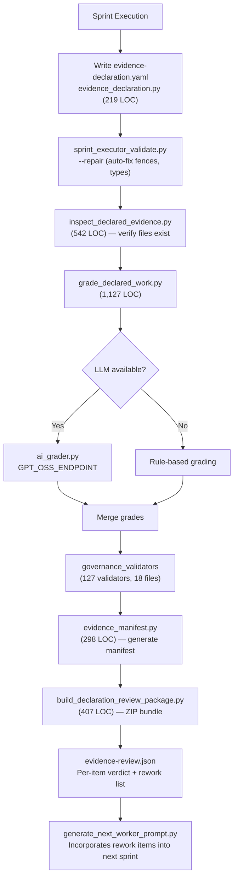
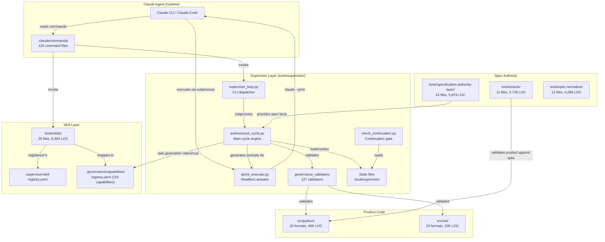

# 02 - Current Machinery Architecture

## Overview

This document maps the supervisor machinery architecture as observed at commit `6b3f6f07`
on branch `main`, 2026-07-06. All LOC counts, file counts, and import relationships were
verified by direct inspection of the working tree.

The supervisor machinery is organized around six primary entry points, with supporting
layers for orchestration, governance, evidence processing, state management, AI integration,
and prompt generation. The dominant integration pattern is **subprocess dispatch** — most
components are standalone CLI scripts invoked via `subprocess.run()` rather than imported
as libraries.

---

## 1. Entry Points (6 Primary)

| # | File | LOC | Role |
|---|---|---|---|
| 1 | `tools/supervisor/supervisor_loop.py` | 605 | CLI dispatcher with 14 subcommands (8 canonical, 6 legacy). Runs sub-scripts via subprocess. |
| 2 | `tools/supervisor/autonomous_cycle.py` | 2,651 | Declaration-driven supervisor cycle: validate, inspect, grade, plan-next, manifest. Exit codes: 0 (continue), 3 (rework), 9 (error). |
| 3 | `tools/supervisor/check_continuation.py` | 796 | Deterministic continuation checker. Reads `continuation-signal.json`, validates session identity (CCI-MVP), plan locks, approval gates. Exit: 0=CONTINUE, 1=STOP. |
| 4 | `tools/supervisor/sprint_executor.py` | 628 | Actuator layer: invokes `claude --print` headlessly for sprints. Subcommands: inject-declaration, run-sprint, run-loop, build-review-package, status. |
| 5 | `tools/supervisor/autonomous_loop_runner.py` | 922 | Alternative orchestration loop (zero imports from other supervisor files). |
| 6 | `tools/supervisor/external_host_loop.py` | 674 | External host loop runner (zero imports from other supervisor files). |

Entry points 5 and 6 are notable for having **zero imports** from the rest of the supervisor
codebase. They are self-contained alternatives that duplicate logic found in the primary
cycle (entry points 1-4). This is a key consolidation indicator.

---

## 2. Component Groups

### 2.1 Orchestration Layer (10 files, 9,964 LOC)

The "autonomous_*" family handles sprint loop execution, task generation, and orchestration.

| File | LOC | Functions | Responsibility |
|---|---|---|---|
| `autonomous_cycle.py` | 2,651 | 4 | Main cycle: validate, inspect, grade, plan-next, manifest |
| `autonomous_task_generator.py` | 1,920 | 8 | Gap-ledger-driven task generation and prioritization |
| `autonomous_cycle_extensions.py` | 1,171 | — | Lane counters, rotation logic, conflict detection |
| `autonomous_cycle_extensions/__init__.py` | 302 | — | Extension loader (importlib) |
| `autonomous_loop_runner.py` | 922 | — | Alternative standalone loop (zero imports) |
| `autonomous_poc_controller.py` | 840 | — | Proof-of-concept sprint controller |
| `autonomous_train_executor.py` | 698 | — | Train-mode executor (batch sprints) |
| `autonomous_host_runner.py` | 651 | — | Host-mode runner |
| `autonomous_orchestrator.py` | 663 | — | Orchestrator abstraction layer |
| `autonomous_cycle_utils.py` | 335 | — | Extracted helpers for cycle |
| `autonomous_host_daemon.py` | 113 | — | Host daemon entry point |

Growth pattern: `autonomous_cycle.py` is the canonical engine. As new execution modes were
needed (PoC, train, host, standalone loop), new files were added rather than extending the
core cycle. This produced 5 alternative orchestrators that partially overlap with the primary.

### 2.2 Governance and Validation (35 files, 16,030 LOC)

Split into two distinct families:

**Governance Validators (18 files, 10,908 LOC):**

| File | LOC | Functions | Role |
|---|---|---|---|
| `governance_validators.py` | 3,183 | 53 | Core validator suite (V001-V082) |
| `governance_validators_ext.py` | 1,098 | — | Extension batch 1 |
| `governance_validators_ext2.py` | 815 | — | Extension batch 2 |
| `governance_validators_ext3.py` | 632 | — | Extension batch 3 |
| `governance_validators_ext4.py` | 588 | — | Extension batch 4 |
| `governance_validators_dotnet.py` | 597 | — | .NET-specific validators |
| `governance_validators_dotnet_semantic.py` | 469 | — | .NET semantic validators |
| `governance_validators_consumer_proof.py` | 341 | — | Consumer proof validators |
| `governance_validators_found_issue.py` | 387 | — | Found-issue validators |
| `governance_validators_gate_auth.py` | 405 | — | Gate authorization validators |
| `governance_validators_layers.py` | 395 | — | Layer governance validators |
| `governance_validators_ledger.py` | 430 | — | Ledger validators |
| `governance_validators_output_quality.py` | 476 | — | Output quality validators (V134-V136) |
| `governance_validators_path.py` | 327 | — | Path validators (V110) |
| `governance_validators_root_struct.py` | 289 | — | Root structure validators |
| `governance_validators_sal.py` | 295 | — | SAL validators |
| `governance_validators_signal.py` | 347 | — | Signal validators |
| `governance_validators_spec.py` | 434 | — | Spec validators |

Growth pattern: Accretive extension. The core file reached ~3K LOC, then `ext` was added,
then `ext2`, `ext3`, `ext4`. Domain-specific validators were split into dedicated files.
The result is 127 validators across 18 files with no shared validator base class.

**Validate-* Family (17 files, 5,122 LOC):**

Separate from the governance_validators suite. These are standalone validation scripts
invoked via subprocess or `.claude/commands/`:
- `validate_adoption_compliance.py`, `validate_claude_commands.py`, `validate_closeout_gate.py`
- `validate_evidence_integration.py`, `validate_multi_responsibility_file.py`
- `validate_mutation_guard.py`, `validate_source_architecture.py`, etc.

### 2.3 Evidence Pipeline (~12K LOC in tools/supervisor/ + 21K in tools/evidence/)

**tools/supervisor/ evidence files:**

| File | LOC | Role |
|---|---|---|
| `grade_declared_work.py` | 1,127 | Grading with optional LLM |
| `inspect_declared_evidence.py` | 542 | Evidence file inspection |
| `materialize_declared_evidence.py` | 424 | Evidence materialization |
| `build_declaration_review_package.py` | 407 | Review package builder |
| `evidence_auto_packager.py` | 405 | Auto-packaging |
| `evidence_continuation.py` | 366 | Continuation logic |
| `evidence_manifest.py` | 298 | Manifest generation |
| `discover_latest_evidence.py` | 274 | Evidence discovery |
| `focused_evidence_extractor.py` | 261 | Focused extraction |
| `evidence_declaration.py` | 219 | Declaration validation |
| `before_after_evidence.py` | 183 | Before/after comparison |

**tools/evidence/ (15 files, 21,396 LOC):**

| File | LOC | Role |
|---|---|---|
| `run050_sprint_writer.py` | 4,116 | Latest evidence sprint writer |
| `run048_sprint_writer.py` | 3,103 | Versioned snapshot |
| `run046_sprint_writer.py` | 2,922 | Versioned snapshot |
| `run047_sprint_writer.py` | 2,709 | Versioned snapshot |
| `run049_sprint_writer.py` | 2,690 | Versioned snapshot |
| `validate_evidence_bundle.py` | 2,638 | Evidence bundle validation |
| Remaining 9 files | 3,218 | Utilities, helpers |

The 5 versioned sprint writers (run046-050) total 15,540 LOC. They are snapshot copies,
not refactored iterations — only `run050` is active. The prior 4 are dead code.

### 2.4 State Management (~5K LOC)

| File | LOC | Role |
|---|---|---|
| `write_plan_lock.py` | 691 | Plan lock creation (IN_PROGRESS, TERMINAL_CLOSED, SUPERSEDED) |
| `plan_identity.py` | 489 | Plan identity resolution |
| `action_queue.py` | 340 | Action queue management |
| `reopen_plan_lock.py` | 321 | Plan lock reopening |
| `continuation_state.py` | 278 | Continuation signal read/write |
| `continuation_identity.py` | 259 | CCI-MVP session identity |
| `reset_track_signal.py` | 160 | Track signal reset |
| `continuation_selector.py` | 150 | Work selection from continuation |
| `continuation_router.py` | 146 | Routing logic |
| `continuation_ledger.py` | 136 | Sprint ledger tracking |
| `plan_placement.py` | 107 | Plan file placement logic |
| `plan_lock_gc.py` | 42 | Garbage collection for stale locks |

State is persisted to `.local/supervisor/` (gitignored) as JSON files:
- `continuation-signal.json` — iteration counter, session_id, autonomous_continue flag
- `active-plan-lock.json` — current plan lock status
- `plan-locks/<session_id>.json` — session-keyed plan locks
- `lifecycle-audit-results.json` — audit output

### 2.5 AI Integration (~4K LOC in supervisor, 4,327 in tools/ai/)

**Supervisor AI files (6 files, 1,367 LOC total):**
- `ai_grader.py`, `ai_task_ranker.py`, `ai_evidence_reviewer.py`
- `ai_gap_analyzer.py`, `ai_sprint_planner.py`, `ai_conflict_detector.py`

All 6 have **zero imports from other supervisor files** — they are self-contained utilities
that call external LLM APIs (GPT_OSS_ENDPOINT). Used optionally by `grade_declared_work.py`.

**tools/ai/ (43 files, 4,327 LOC):**
- `embedding_retrieval.py` (838 LOC) — embedding-based code search
- `summary_classifier.py` (420 LOC) — AI-based classification
- Remaining 41 files — various AI pipeline utilities

### 2.6 Prompt Generation (~8K LOC)

| File | LOC | Functions | Role |
|---|---|---|---|
| `generate_next_worker_prompt.py` | 1,546 | 26 | Worker sprint prompt generation |
| `generate_supervisor_packet.py` | 1,437 | 20 | Supervisor review packet |
| `generate_mainstream_execution_packet.py` | 486 | — | Mainstream execution packet |
| `generate_sprint_learning.py` | 371 | — | Sprint learning extraction |
| `generate_closure_artifacts.py` | 353 | — | Closure artifact generation |
| `generate_stream_routing_packet.py` | 292 | — | Stream routing packet |
| `generate_stream_gaps.py` | 291 | — | Stream gap detection |
| `stream_prompt_generator.py` | 183 | — | Stream prompt generation |

These are the "last mile" — they assemble context from state files, gap ledgers,
and evidence into prompts consumed by `sprint_executor.py` (which passes them to `claude --print`).

---

## 3. Key Design Patterns

### 3.1 Subprocess Dispatch (56 call sites)

The dominant integration mechanism. `supervisor_loop.py` dispatches to sub-scripts via
`subprocess.run()`. `sprint_executor.py` dispatches to the `claude` CLI via subprocess.
Many validate-* and generate-* scripts are invoked only via subprocess, never imported.

This explains the high count of `if __name__ == '__main__'` guards (142 files) — most
files are designed as standalone CLI tools, not importable libraries.

### 3.2 importlib Dynamic Loading (4 sites)

Used in:
- `autonomous_cycle.py` — dynamic step loading
- `authority_conveyor.py` — authority module loading
- `check_system_healing_gate.py` — gate checker loading
- `autonomous_cycle_extensions/__init__.py` — extension discovery

### 3.3 Accretive Extension (governance validators, autonomous-* family)

When a file exceeds a soft LOC limit, a new file is created with a numeric suffix
(`ext`, `ext2`, `ext3`, `ext4`) rather than refactoring the original. This preserves
backward compatibility but produces duplication and inconsistent interfaces.

### 3.4 Versioned Snapshots (evidence sprint writers)

Evidence sprint writers (run046-050) are full-file copies, not incremental diffs.
Only the latest (`run050`) is active. Prior versions are retained but never called.

### 3.5 Zero-Import Isolation

Multiple files (`autonomous_loop_runner.py`, `external_host_loop.py`, all 6 `ai_*` files)
have zero imports from the rest of the supervisor codebase. They are fully self-contained,
which aids independent deployment but means shared logic is duplicated.

---

## 4. Architecture Diagrams

### 4.1 Component Architecture

```mermaid
flowchart TB
    subgraph EntryPoints["Entry Points"]
        SL["supervisor_loop.py<br/>605 LOC — CLI dispatcher"]
        AC["autonomous_cycle.py<br/>2,651 LOC — main cycle"]
        CC["check_continuation.py<br/>796 LOC — continuation gate"]
        SE["sprint_executor.py<br/>628 LOC — actuator"]
        ALR["autonomous_loop_runner.py<br/>922 LOC — alt loop"]
        EHL["external_host_loop.py<br/>674 LOC — host loop"]
    end

    subgraph Orchestration["Orchestration (10 files, 9,964 LOC)"]
        ATG["autonomous_task_generator"]
        ACE["autonomous_cycle_extensions"]
        APC["autonomous_poc_controller"]
        AO["autonomous_orchestrator"]
    end

    subgraph Governance["Governance & Validation (35 files, 16,030 LOC)"]
        GV["governance_validators<br/>18 files, 10,908 LOC"]
        VF["validate-* family<br/>17 files, 5,122 LOC"]
    end

    subgraph Evidence["Evidence Pipeline (26 files, ~33K LOC)"]
        ED["evidence_declaration"]
        GDW["grade_declared_work"]
        IE["inspect_declared_evidence"]
        BRP["build_declaration_review_package"]
        ESW["evidence sprint writers<br/>run046-050"]
    end

    subgraph State["State Management (~5K LOC)"]
        CS["continuation-signal.json"]
        PL["plan locks"]
        AQ["action_queue"]
    end

    subgraph Prompts["Prompt Generation (~8K LOC)"]
        GNW["generate_next_worker_prompt"]
        GSP["generate_supervisor_packet"]
    end

    subgraph AI["AI Integration (~5.7K LOC)"]
        AIG["ai_grader / ai_ranker"]
        ER["embedding_retrieval"]
    end

    SL -->|subprocess| AC
    SL -->|subprocess| SE
    SL -->|subprocess| CC
    AC --> ATG
    AC --> ACE
    AC --> GV
    AC --> ED
    AC --> IE
    AC --> GDW
    AC --> GNW
    CC --> CS
    CC --> PL
    SE -->|"claude --print"| Claude["Claude CLI"]
    SE --> GSP
    ALR -.->|"zero imports<br/>standalone"| AC
    EHL -.->|"zero imports<br/>standalone"| AC
    GDW -.->|optional| AIG
```

### 4.2 Execution Lifecycle (Sprint Flow)

### 4.3 State Ownership

### 4.4 Evidence Flow (Declaration Through Grading to Review)

### 4.5 Agent / Supervisor / Skill / Product Boundaries

---

## 5. Structural Observations

### 5.1 Multiple Overlapping Orchestrators

There are at least 4 ways to run the autonomous sprint loop:

1. `supervisor_loop.py autonomous-cycle` — canonical CLI path
2. `sprint_executor.py run-loop` — headless loop with `claude --print`
3. `autonomous_loop_runner.py` — standalone zero-import loop
4. `external_host_loop.py` — host-mode loop

These share the same conceptual flow (check continuation, execute sprint, close out, repeat)
but implement it independently. Entry points 3 and 4 have zero imports from the rest of the
supervisor, meaning any bug fix or behavior change in the canonical path must be manually
replicated.

### 5.2 Governance Validator Fragmentation

127 validators across 18 files with no shared base class or registration mechanism. New
validators are added to whichever extension file has room. The accretive `ext/ext2/ext3/ext4`
naming reflects organic growth rather than domain-driven organization.

### 5.3 Evidence Sprint Writer Snapshots

5 versioned sprint writers (run046-050) totaling 15,540 LOC. Only `run050` is called by
any current code path. The prior 4 (run046-049) are dead code that will never execute but
are counted in LOC metrics and inflated the original 81K claim.

### 5.4 Subprocess as Integration Contract

56 subprocess call sites in `tools/supervisor/` mean the integration contract between
components is the command-line interface (argv + exit code + stdout/stderr), not Python
function signatures. This provides process isolation but makes:
- Refactoring harder (no static analysis of callers)
- Error propagation lossy (exit codes collapse rich errors)
- Testing slower (process spawn overhead)

### 5.5 Zero-Import Islands

8+ files have zero imports from other supervisor modules. They are fully self-contained,
which means any shared logic (argument parsing, state file reading, error handling) is
duplicated. These islands include the 6 `ai_*` files, `autonomous_loop_runner.py`, and
`external_host_loop.py`.

---

## 6. Component Dependency Summary

| Component | Depends On | Depended On By |
|---|---|---|
| `check_continuation.py` | State files only | All loop runners |
| `autonomous_cycle.py` | governance_validators, evidence pipeline, task generator, prompt generator | supervisor_loop.py |
| `sprint_executor.py` | Claude CLI (external) | supervisor_loop.py, loop runners |
| `governance_validators*` | Product source (reads), registries (reads) | autonomous_cycle.py |
| `evidence pipeline` | Declaration YAML, product artifacts | autonomous_cycle.py |
| `prompt generation` | State files, evidence review, gap ledger | autonomous_cycle.py, sprint_executor.py |
| `state management` | Filesystem (.local/supervisor/) | check_continuation.py, autonomous_cycle.py |
| `ai_* files` | External LLM API only | grade_declared_work.py (optional) |
| `autonomous_loop_runner.py` | Nothing internal | Called directly by user/daemon |
| `external_host_loop.py` | Nothing internal | Called directly by external host |
