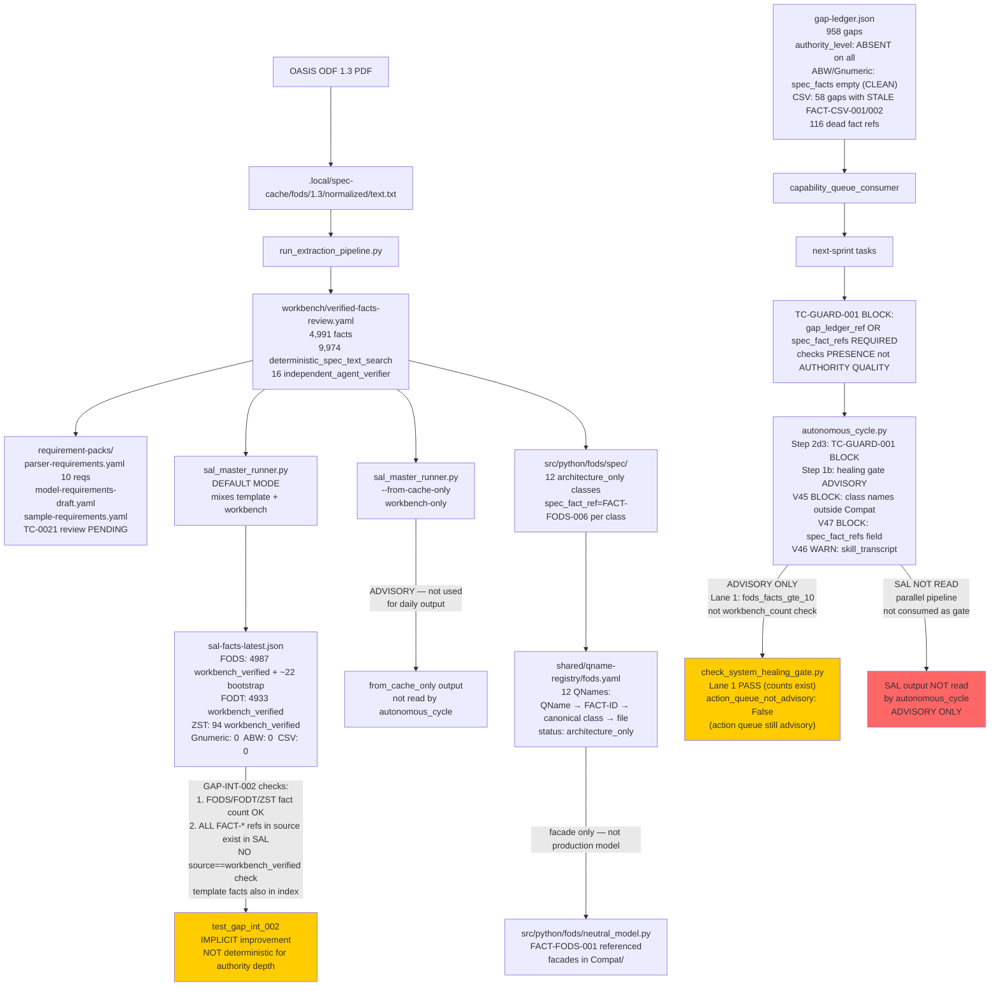

# Spec Authority Machinery — Flow Map

**Run ID:** `spec-authority-machinery-explosion-20260621-827f5a52`
**Date:** 2026-06-21

---

## Diagram 1: Intended Spec Authority Chain (Design Intent)

```
OASIS ODF 1.3 PDF / External Spec
  ↓
.local/spec-cache/{format}/normalized/text.txt  (one per format)
  ↓
run_extraction_pipeline.py  (NLP extraction)
  ↓
workbench/verified-facts-review.yaml  (human-reviewed, deterministic methods)
  ↓
requirement-packs/*.yaml  (structured requirements referencing FACT-IDs)
  ↓
sal_master_runner.py --from-cache-only  (publish only workbench-verified facts)
  ↓
sal-facts-latest.json  (authority: workbench_verified, source field per fact)
  ↓
GAP-INT-002  (validates FACT-* refs in product source exist in SAL; checks source==workbench_verified)
  ↓
gap-ledger.json  (gaps cite spec facts with authority_level field)
  ↓
TC-GUARD-001  (BLOCK: no PRODUCT_SOURCE without gap_ledger_ref + verified spec facts)
  ↓
autonomous_cycle.py  (reads SAL facts; enforces spec authority as blocking gate)
  ↓
PRODUCT_SOURCE  (spec_qname + spec_fact_ref wired to canonical class via QName registry)
  ↓
Healing gate Lane 1  (checks workbench_verified_fact_count > 0 per format; blocks if zero)
```

---

## Diagram 2: Actual Flow (Current Reality — HEAD ed51041f)



---

## Diagram 3: FODS Authority Chain (Highest Proof Level — P5)

```
OASIS ODF 1.3 PDF
  ↓
.local/spec-cache/fods/1.3/normalized/text.txt  (VERIFIED: exists)
  ↓
verified-facts-review.yaml  (4,991 facts, 9,974+16 verification methods)
  ↓
requirement-packs/  (3 YAMLs; TC-0021 traceability review pending)
  ↓
FACT-FODS-001 through FACT-FODS-NNN  (workbench_verified in SAL output)
  ↓
shared/qname-registry/fods.yaml  (FACT-FODS-006 → table:table-cell → Table.TableCell → table_cell.py)
  ↓
src/python/fods/spec/table/table_cell.py  (spec_fact_ref = "FACT-FODS-006", architecture_only)
  ↓
src/python/fods/Compat/FodsCell  (facade → production model)
  ↓
src/python/fods/neutral_model.py  (FACT-FODS-001 cited in source comments)
  ↓
test_gap_int_002: verifies FACT-FODS-001 exists in SAL output  ← PASS
```

**Chain rating: STRONG** — all links present. Weak point: req-pack TC-0021 review pending; SAL daily output is default mode (template facts mixed in).

---

## Diagram 4: Gnumeric/ABW/CSV Bypass Paths (P1-P2)

```
No external spec source acquired (Gnumeric XML schema: no normalized text)
  ↓ (skipped — no normalized text)
No workbench facts  → 0 SAL facts for Gnumeric, ABW, CSV
  ↓
gap-ledger.json entries:
  ABW: 50 gaps, spec_facts: []  (stale magic IDs cleaned)
  Gnumeric: 36 gaps, spec_facts: []  (stale magic IDs cleaned)
  CSV: 58 gaps, spec_facts: ['FACT-CSV-001', 'FACT-CSV-002']
    └→ DEAD REFS: FACT-CSV-001 / FACT-CSV-002 NOT in sal-facts-latest.json
  ↓
TC-GUARD-001: accepts items citing ABW/Gnumeric/CSV gap references
  └→ no authority_level check; gap presence satisfies guard
  ↓
GAP-INT-002: no ABW/Gnumeric/CSV fact count assertions
  └→ those formats can have 0 SAL facts without failing any test
  ↓
Healing gate Lane 1: checks fods_facts_gte_10 only
  └→ Gnumeric/ABW/CSV zero-fact status does NOT affect gate result (PASS)
  ↓
autonomous_cycle.py: does not read SAL output at all
  └→ no SAL-based gate for any format
```

**Effect:** A PRODUCT_SOURCE item for Gnumeric, ABW, or CSV can pass all gates (TC-GUARD-001, healing gate, GAP-INT-002) despite those formats having ZERO spec-backed SAL facts. The gap reference provides apparent spec backing without actual substance.

---

## Diagram 5: SAL Mode Ambiguity

```
sal_master_runner.py
  ├─ Default mode (from_cache_only=False):
  │    Template facts + workbench facts merged
  │    FODS output: 4,987 wb + ~22 bootstrap_only template facts
  │    This is what generates sal-facts-latest.json
  │
  └─ Clean mode (from_cache_only=True):
       Only workbench-verified facts emitted
       Gnumeric/ABW/CSV emit 0 facts (correct)
       Used by: test_sal_runner_idempotency.py tests
       NOT used for: daily sal-facts-latest.json generation
```

**Gap:** The "SAL idempotency fix" controls clean mode behavior. But the daily output file is in default mode. GAP-INT-002 reads the default-mode output. So template facts are still in the fact index that GAP-INT-002 uses to validate product source citations.
