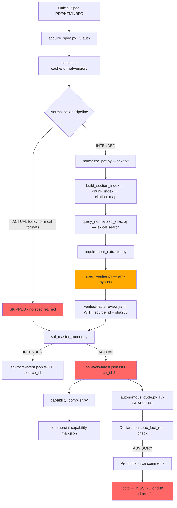

# Specs Authority Layer — Architecture Map
**Run ID:** spec-auth-inv-20260621-001
**Date:** 2026-06-21

---

## 1. Intended Flow (design baseline)

```
Official Spec (PDF/HTML/RFC)
        │
        ▼  [T3 Authorization — 6 conditions]
  acquire_spec.py ──► .local/spec-cache/<format>/<version>/
        │                     │
        │              spec-index.yaml (SHA-256 + provenance)
        │
        ▼  [Hash verification before normalization]
  normalize_pdf.py ──► text.txt (plain text extraction)
        │
        ▼
  build_section_index.py ──► section-index.yaml (deterministic section IDs)
  build_chunk_index.py   ──► chunk-index.jsonl  (stable chunk IDs)
  build_citation_map.py  ──► citation-map.yaml   (chunk→section mapping)
        │
        ▼  [Lexical search — Tier 1/2 retrieval]
  query_normalized_spec.py ──► spec excerpts with page/section/SHA citation
        │
        ▼  [Fact extraction with source_id]
  requirement_extractor.py ──► CandidateRequirements (each with source_id, section, text_fragment)
        │
        ▼  [Anti-bypass verification]
  spec_verifier.py ──► VerifiedFacts (VERIFIED | UNVERIFIABLE | ANTI_BYPASS_REJECTED)
        │
        ▼  [Workbench storage with provenance]
  .local/spec-cache/<format>/workbench/verified-facts-review.yaml
        │
        ▼  [SAL aggregation]
  sal_master_runner.py ──► .local/sal-output/sal-facts-latest.json
        │                   (facts WITH source_id, sha256, section citation)
        ▼  [Capability map enrichment]
  capability_compiler.py ──► commercial-capability-map.json (SAL-enriched)
        │
        ▼  [Integration with product]
  Acquisition prompts / Product taskcards / TC-GUARD-001 enforcement
  Source code comments: spec_fact_refs: <FACT-ID>
  Tests: validate spec-fact→product linkage
```

---

## 2. Actual Discovered Flow

```
[COLD START — most formats]
No spec cache → NO normalization → NO workbench →
sal_master_runner.py uses HARDCODED templates →
.local/sal-output/sal-facts-latest.json
  (facts: verified_status="verified" BUT source_id=MISSING)

[7 formats with some workbench — FODS/FODT/ZST/Netpbm/CSV]
  .local/spec-cache/<format>/workbench/verified-facts-review.yaml
    ← run_fact_verification.py (text search against cached text)
    ← Manual curation
  fact-coverage-report.json: FODS 27.3%, FODT 100% (27 facts), ZST 100% (15 facts)
  csv 0%, others unknown

[SAL master runner — TODAY's actual path]
  sal_master_runner.py reads format-registry.yaml
  ↓
  Looks up spec_body (OASIS, IETF, DEFAULT, etc.)
  ↓
  Applies HARDCODED _SPEC_FACT_TEMPLATES + _FORMAT_SPECIFIC_FACTS
  ↓
  NO spec_parser, NO spec_verifier, NO source_id attached
  ↓
  Writes .local/sal-output/sal-facts-latest.json
    {format_id, spec_facts: [{qname, section, description, verification_status: "verified"}]}
    ← NO source_id field

[Supervisor integration — PARTIAL]
  autonomous_cycle.py step 0a: SAL regeneration check (7-day stale)
  autonomous_cycle.py step 2d2: requires spec_fact_refs in declarations (TC-GUARD-001)
  autonomous_cycle.py step 3d: SAL + capability map recompute post-grade

[Product integration — COMMENT ONLY]
  src/python/fods/neutral_model.py: # FACT-FODS-001 in docstrings
  src/python/zst/zst_codec.py: # spec_fact_refs: FACT-ZST-001 in comments
  NO enforcement by automated test
  NO bidirectional lookup: fact → code, code → fact
```

---

## 3. Missing Flow (designed but not wired)

```
MISSING: spec_parser.py / spec_indexer.py / spec_normalizer.py / spec_digestor.py
  ← These modules EXIST but are NOT called by sal_master_runner.py

MISSING: spec_verifier.py called on SAL-generated facts
  ← Would reject facts with no source_id (ANTI_BYPASS_REJECTED)
  ← NOT called by master runner

MISSING: requirement_extractor.py → CandidateRequirements → sal_master_runner output
  ← Exists but not wired in

MISSING: refresh_workbench.py automated trigger on hash change
  ← Exists but not called automatically

MISSING: detect_coverage_gaps.py automated reporting
  ← Exists but not wired

MISSING: build_requirement_pack.py → export_task_packet.py → acquisition prompts
  ← Designed pipeline not implemented end-to-end

MISSING: vector index (namespace_manager.py is STUB requiring LanceDB not authorized)
  ← Designed but not implemented

MISSING: tests enforcing source_id presence on facts
MISSING: tests for stale-hash detection
MISSING: end-to-end traceability test (spec text → fact → requirement → product code → test)
```

---

## 4. Contradictory Flow

```
CONTRADICTION 1: spec_verifier.py has anti-bypass rule "No source_id → ANTI_BYPASS_REJECTED"
  BUT sal_master_runner.py emits facts with NO source_id
  RESULT: The verifier exists but is never called; facts pass "verified" with no real verification

CONTRADICTION 2: run_fact_verification.py promotes facts to "verified" via text search
  BUT facts stored in sal-facts-latest.json have NO source_id linking back to the source text
  RESULT: "verified" label exists without traceable provenance

CONTRADICTION 3: AGENTS.md §X4 requires "Every spec excerpt cited in an evidence artifact must include: section ID, page number, source SHA-256 hash, spec version, and retrieval method"
  BUT evidence declarations cite spec_fact_refs (FACT-ZST-001) without requiring the underlying fact to have source SHA-256
  RESULT: Provenance requirement in policy not enforced mechanically

CONTRADICTION 4: docs/spec-retrieval-strategy.md status is "Proposed — awaiting human review"
  BUT autonomous_cycle.py uses SAL facts (which embed section refs from this strategy) daily
  RESULT: Strategy marked not-yet-approved is operationally active

CONTRADICTION 5: 10 sources registered with spec_source_registry.py
  BUT 9 of 10 have sha256_snapshot=None (not fetched)
  RESULT: "registered" source status is not the same as "available for verification"
```

---

## 5. Where Authority Enters the System

```
STRONGEST ENTRY POINTS:
  1. spec-index.yaml — SHA-256 of cached spec file (manual, FODS only confirmed)
  2. verified-facts-review.yaml — workbench verified facts (7 formats, 37.8% overall)
  3. sal-facts-latest.json — daily-refreshed format facts (but HARDCODED, no source_id)

WEAKEST ENTRY POINTS:
  4. Product source comments (# spec_fact_refs: FACT-ZST-001) — advisory only
  5. Declaration spec_fact_refs field — checked by TC-GUARD-001 but fact itself unverified
```

---

## 6. Where Authority is Enforced

```
ENFORCED (mechanically):
  - TC-GUARD-001: autonomous_cycle.py step 2d2 — rejects declarations without spec_fact_refs
  - AI authority lifecycle state machine — enforces transition chain (tested)
  - spec_verifier.py anti-bypass — enforced at unit level (but NOT called by master runner)

ADVISORY (documented but not mechanically enforced):
  - AGENTS.md T1/T6 spec cache rules (prompt-only)
  - GOVERNANCE.md §22.3 LLMs not authority (prompt-only)
  - docs/specification-cache.md T3 authorization (prompt-only)
  - acquisition playbook provenance gates (documented in playbook.yaml, not runtime-checked)
```

---

## 7. Where Authority is Bypassed

```
BYPASS 1 (CRITICAL): sal_master_runner.py writes facts with no source_id
  ← Bypasses spec_verifier.py's anti-bypass check entirely

BYPASS 2 (HIGH): TC-GUARD-001 checks for spec_fact_refs in declaration
  ← But does NOT verify that the referenced FACT-ID has a source_id or verified text link

BYPASS 3 (HIGH): Source code uses FACT-FODS-001 references in comments
  ← No test verifies the comment reference points to an actually-verified fact

BYPASS 4 (MEDIUM): Most spec sources not fetched (9 of 10 sha256=None)
  ← Verification runs against spec text that may not exist or not be hash-verified

BYPASS 5 (MEDIUM): FODS workbench has 201 facts pending_verification (72.7% of total)
  ← These facts drive production decisions without source text confirmation
```

---

## 8. Where AI/Embeddings Are or Could Be Used

```
CURRENT AI USAGE (all advisory/governance only):
  - tools/ai/validators/authority_lifecycle.py: state machine for AI artifact promotion
  - tools/supervisor/embedding_retrieval.py: advisory lexical retrieval of prior evidence
  - AI governance model (roles.yaml, forbidden-runtime-imports.yaml)
  - No actual LLM calls in SAL pipeline

PLANNED/DESIGNED (not implemented):
  - tools/ai/retrieval/namespace_manager.py: format-segregated vector stores (STUB, LanceDB)
  - tools/ai/pipeline/e2e_pilot.py: E2E AI pipeline (designed)
  - tools/ai/synthesis/ (designed)

FORBIDDEN (by contract):
  - qdrant, chromadb, pinecone — forbidden per tools/ai/contracts/forbidden-runtime-imports.yaml
  - AI output as authority without source verification

SAFE TO ADD (with controls):
  - Lexical search augmentation for workbench queries (Tier 2 per spec-retrieval-strategy.md)
  - Embedding-based candidate spec section finder (advisory only, must cite source)
```

---

## 9. Mermaid Diagram — Actual vs Intended


