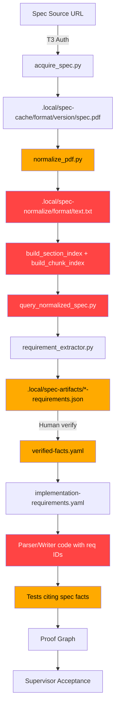

# Specs Authority Layer — Architecture Map
# Sprint: SPEC-AUTHORITY-LAYER-PRODUCTION-INVESTIGATION-001
# Generated: 2026-06-06

---

## 1. Intended Architecture (from policy docs)

The intended design (per docs/specification-cache.md, docs/specification-normalization.md,
docs/spec-retrieval-strategy.md) defines this authority chain:

```
Official Spec Source (URL)
    │
    ▼ [T3 Authorization Required]
tools/spec-cache/acquire_spec.py
    │  - SHA-256 computed
    │  - spec-index.yaml written
    ▼
.local/spec-cache/<format>/<version>/
    ├── spec.pdf (or .html, .xml)
    ├── spec-index.yaml  ← provenance, SHA-256, legal metadata
    └── normalized/      ← derived
    │
    ▼
tools/spec-normalize/normalize_pdf.py
    │  - PDF → text pages
    ▼
tools/spec-normalize/build_section_index.py
    │  - section ID → page mapping
    ▼
tools/spec-normalize/build_chunk_index.py
    │  - chunked text for retrieval
    ▼
tools/spec-normalize/build_citation_map.py
    │  - element/section → page citations
    ▼
.local/spec-normalize/<format>/
    ├── text.txt (normalized text)
    ├── pages.jsonl (chunk index)
    ├── sections.yaml (section index)
    └── citations.yaml (citation map)
    │
    ▼  [Three-Tier Retrieval]
tools/spec-normalize/query_normalized_spec.py
    ├── Tier 1: deterministic (section/element/page lookup)
    ├── Tier 2: lexical (full-text search over normalized text)
    └── Tier 3: vector/RAG  [DESIGN ONLY — not authorized]
    │
    ▼
tools/specification-authority-layer/requirement_extractor.py
    │  - RFC 2119 keyword extraction
    │  - CandidateRequirement records
    ▼
tools/specification-authority-layer/requirement_graph.py
    │  - Requirement → source section graph
    ▼
.local/spec-artifacts/<FORMAT>-SPEC-001-requirements.json  [status: candidate]
    │
    ▼ [Human/Automated Verification]
verified-facts.yaml  (status: verified | rejected | needs_review)
    │
    ▼
acquisition-packs/<format>/implementation-requirements.yaml
    │  - spec-backed, verified, with source_refs
    ▼
Parser/Writer implementation
    │  - code references requirement IDs
    ▼
Tests
    │  - test IDs traceable to requirements
    ▼
Proof Graph
    │  - requirement → capability → test → code
    ▼
Evidence Declaration → Supervisor Acceptance
```

---

## 2. Actual Discovered Architecture

```
Official Spec Source (URL)
    │
    ▼ [T3 Authorization — IMPLEMENTED, used for FODS]
tools/spec-cache/acquire_spec.py (DRY-RUN by default)
    │
    ▼
.local/spec-cache/<format>/<version>/spec-index.yaml
    ├── FODS/1.3: SHA-256 verified, 24.27 MB PDF present  ← ONLY FORMAT WITH PDF
    ├── ABW/awml-1.0: spec-index.yaml only, no PDF        ← METADATA ONLY
    ├── CSV/rfc4180: spec-index.yaml only                 ← METADATA ONLY
    ├── DIF/v1: spec-index.yaml only                      ← METADATA ONLY
    ├── GNUMERIC/v10: spec-index.yaml only                ← METADATA ONLY
    ├── PBM/netpbm-spec: spec-index.yaml only             ← METADATA ONLY
    ├── PGM/netpbm-spec: spec-index.yaml only             ← METADATA ONLY
    ├── TSV/informal: spec-index.yaml only                ← METADATA ONLY
    └── ZST/rfc8878+rfc9659: spec-index.yaml + section-index.yaml ← PARTIAL
    │
    ▼ [Normalization — ONLY RUN FOR FODS]
.local/spec-cache/fods/1.3/normalized/
    ├── citations.yaml       ← PRESENT
    ├── page-map.yaml        ← PRESENT
    ├── parser-requirements-draft.yaml ← PRESENT
    ├── sample-requirements.yaml      ← PRESENT
    └── source-manifest.yaml          ← PRESENT
    │
    ▼ [.local/spec-normalize/ DOES NOT EXIST]
    │   No normalized text.txt, pages.jsonl, sections.yaml
    │   No retrieval index for any format
    │
    ▼ [Spec Authority Layer Tools — IMPLEMENTED, used in tests]
tools/specification-authority-layer/
    ├── spec_source_registry.py   ← Working; used in tests
    ├── spec_vault_ingest.py      ← Working; used in tests
    ├── spec_governance_runtime.py ← Working; anti-bypass enforced
    ├── context_pack_builder.py   ← Working; used in tests
    └── requirement_extractor.py  ← Working; extracts from fixture text
    │
    ▼ [Spec Artifacts — SYNTHETIC SEED DATA]
.local/spec-artifacts/
    ├── FODS-SPEC-001-requirements.json  ← 6 candidate requirements from fixture text
    ├── FODT-SPEC-001-requirements.json  ← synthetic
    ├── DIF-SPEC-001-requirements.json   ← synthetic
    ├── GNUMERIC-SPEC-001-requirements.json ← synthetic
    └── ... (30 files total)
    │   STATUS: "candidate" — NOT verified against real spec
    │
    ▼ [Registry NOT persisted]
    │   .local/spec-source-registry/ DOES NOT EXIST
    │   Registry lives only in memory during test runs
    │
    ▼ [Verified Facts — FODS ONLY, 10 facts]
.local/spec-cache/fods/1.3/workbench/verified-facts.yaml
    │  ← 10 manually seeded facts, NOT extracted from PDF
    │
    ▼ [Acquisition Packs — PARTIAL spec reference]
acquisition-packs/fods/implementation-requirements.yaml
    │  ← References spec sections; has provenance metadata
    │  ← FODS: strongest; FODT: similar; others: weak/missing
    │
    ▼ [Parser/Writer Code — NO requirement ID references]
src/net/fods/, src/python/fods/
    │  ← Code does NOT reference spec fact IDs in source
    │  ← No FACT-FODS-001 or REQ-FODS-SPE-xxx in code
    │
    ▼ [Tests — NO spec fact traceability]
    │  ← .NET tests pass but do not cite spec facts
    │
    ▼ [Proof Graph — EXISTS but spec→code chain is advisory]
.local/spec-artifacts/*-req-graph.json
    ├── Nodes and edges exist
    └── spec_auth node referenced in build_proof_graph_iter001.py
    │   but chain from spec fact → requirement → code → test not enforced
    │
    ▼ [Supervisor Authority Integration]
tools/supervisor/authority_integration_fabric.py
    ├── Checks spec_artifacts_dir.exists()
    ├── Checks for <FORMAT>-SPEC-001-*.json files
    └── Reports completeness: COMPLETE | PARTIAL | MISSING
        ← Generates advisory JSON; does NOT block work
```

---

## 3. Missing Flow (Authority Gaps)

The following intended flows are missing from the actual implementation:

```
[MISSING] Real spec PDF → normalize_pdf.py → text.txt → retrieval index
          (Only FODS has PDF; normalization output dir .local/spec-normalize/ doesn't exist)

[MISSING] Candidate requirements → human/automated verification → verified status
          (All .local/spec-artifacts/ requirements remain "candidate")

[MISSING] Verified facts → implementation-requirements.yaml with spec citations
          (Acquisition packs have partial spec references but not from verified-facts.yaml)

[MISSING] Implementation requirements → parser code with requirement ID annotations
          (Source code has no reference to spec fact IDs)

[MISSING] Spec source registry → persisted sources.jsonl
          (.local/spec-source-registry/ does not exist between sessions)

[MISSING] Supervisor block when verified facts missing for a format
          (authority_integration_fabric generates reports but does NOT block pipeline)

[MISSING] Vector/embedding search (Tier 3)
          (Intentionally not authorized — design only — NOT a gap, by policy)
```

---

## 4. Where Authority Enters the System

| Entry Point | Mechanism | Status |
|-------------|-----------|--------|
| T3 Authorization for spec download | Requires Gate 1 pass + legal review + human recording | ENFORCED for FODS; procedural |
| SHA-256 binding at ingest | spec_vault_ingest.py computes and records SHA-256 | IMPLEMENTED in tests |
| Registry check before citation | spec_governance_runtime.check_citation_allowed() | ENFORCED in tests |
| Requirements validation gate | validate_generated_requirements.py blocks AI-only acceptance | ENFORCED |
| Context pack manifest SHA | context_pack_builder.verify_context_pack() rejects missing SHA | ENFORCED in tests |

---

## 5. Where Authority Is Enforced

| Enforcement Point | What Is Enforced | Evidence |
|-------------------|-----------------|---------|
| tests/spec_authority/ (163 tests) | Source registration, citation validation, staleness, governance runtime | STRONG — all pass |
| tests/requirements/validate_generated_requirements.py (32 tests) | AI-only proposals blocked; source evidence required; traceability map required | STRONG |
| tools/specification-authority-layer/spec_governance_runtime.py | Runtime anti-bypass: no unregistered citations, no memory-only claims | IMPLEMENTED |
| tools/spec-cache/acquire_spec.py | DRY-RUN by default; T3 authorization required for live download | PROCEDURAL |

---

## 6. Where Authority Is Bypassed or Advisory Only

| Bypass Point | How | Risk |
|--------------|-----|------|
| Spec artifacts are synthetic seed data | build_proof_graph_iter001.py injects fixture text, not real spec | HIGH — "verified" claims backed by fabricated text |
| Spec source registry not persisted | .local/spec-source-registry/ missing; registry reset each test run | HIGH — no durable audit trail |
| Acquisition work not blocked when facts missing | Supervisor reports PARTIAL/MISSING but does not block | MEDIUM |
| Parser/writer code has no spec fact references | Code does not cite FACT-xxx or REQ-xxx IDs | HIGH — no traceability |
| .local/spec-normalize/ missing | Cannot do lexical or deterministic retrieval on any format | HIGH — retrieval layer non-operational |
| FODT/ABW/ZST/DIF have no real verified facts | Only candidate synthetic requirements | HIGH |

---

## 7. Mermaid Diagram — Intended vs Actual



Legend:
- Green (no fill) = IMPLEMENTED and operational
- Orange (#ffaa00) = IMPLEMENTED but partial / incomplete / only for FODS
- Red (#ff4444) = MISSING or not operational
